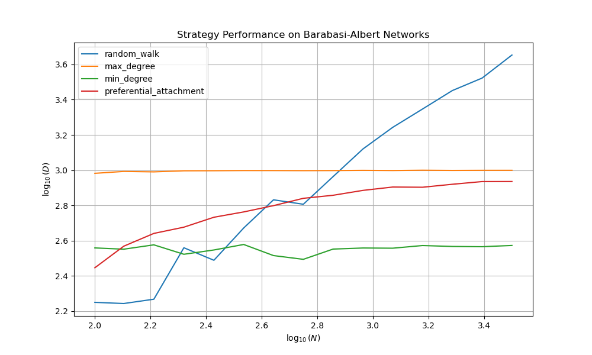
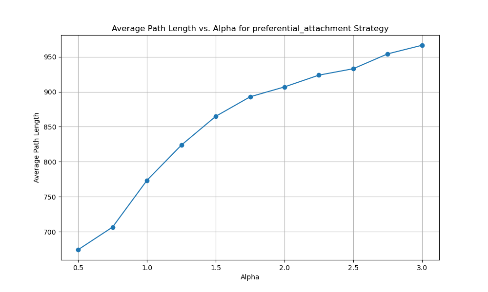

# Complex-Network-Search

## 题目重述

1. 阅读本周参考资料。

2. 生成不同规模$N$的BA网络，分别尝试用随机游走，最大度策略，最小度策略（每次选度最小的邻节点）以及优先附着（度为$k_i$的节点被选中的概率为$k_i/\sum_{j}{k_j}$）来估计网络的平均路径长度$D$，并观察不同方法下，其随着$N$的变化趋势。

3. 如果将2中优先附着的公式修改为$k_i^\alpha/\sum_{j}{k_j^\alpha}$，讨论不同$\alpha$时，对于一个特定的$N$，所估计的$D$如何变化。


## 实现代码

### Task1 不同策略下估计D随N变化

```python
import math
import numpy as np
import matplotlib.pyplot as plt
import networkx as nx
from collections import defaultdict
import csv

def calculate_path_length_with_strategy(G, strategy, alpha=1.0, num_trials=100):
    """
    Calculate average path length using a specific strategy.
    Strategies include 'random_walk', 'max_degree', 'min_degree', 'preferential_attachment'.
    Alpha parameter is used for the preferential attachment strategy.
    """
    np.random.seed(42)  # For reproducibility
    total_path_length = 0
    
    for _ in range(num_trials):
        if strategy == 'random_walk':
            total_path_length += modified_random_walk(G)
        else:
            total_path_length += path_length_with_degree_strategy(G, strategy, alpha)
            
    return total_path_length / num_trials

def modified_random_walk(G):
    """
    Perform a modified random walk that avoids revisiting the same edge consecutively and computes the path length correctly.
    """
    nodes = list(G.nodes())
    start_node = np.random.choice(nodes)
    current_node = start_node
    previous_node = None
    path_length = 0

    while True:
        neighbors = [n for n in G.neighbors(current_node) if n != previous_node]
        if not neighbors:
            break  # End the walk if no other neighbors
        next_node = np.random.choice(neighbors)
        path_length += 1
        if next_node == start_node:
            break  # End the walk if it returns to the start node
        previous_node, current_node = current_node, next_node

    return path_length

def path_length_with_degree_strategy(G, strategy, alpha):
    """
    Calculate path length using degree-based strategies correctly.
    """
    path_lengths = []
    for _ in range(100):  # For each trial
        nodes = list(G.nodes())
        start_node = np.random.choice(nodes)
        current_node = start_node
        total_steps = 0
        
        while total_steps < 1000:  # Limit the number of steps to avoid infinite loop
            if strategy == 'max_degree':
                next_node = max(G.neighbors(current_node), key=G.degree)
            elif strategy == 'min_degree':
                next_node = min(G.neighbors(current_node), key=G.degree)
            elif strategy == 'preferential_attachment':
                neighbors = list(G.neighbors(current_node))
                degrees = np.array([G.degree(n)**alpha for n in neighbors])
                probabilities = degrees / np.sum(degrees)
                next_node = np.random.choice(neighbors, p=probabilities)
            total_steps += 1
            if next_node == start_node:
                break
            current_node = next_node
        path_lengths.append(total_steps)

    return np.mean(path_lengths)

if __name__ == '__main__':
    N_values = np.logspace(2, 3.5, 15, dtype=int)
    strategies = ['random_walk', 'max_degree', 'min_degree', 'preferential_attachment']
    results = defaultdict(list)

    with open('strategy_results.csv', 'w', newline='') as csvfile:
        writer = csv.writer(csvfile)
        writer.writerow(['N'] + strategies)
        
        for N in N_values:
            row = [N]
            G = nx.barabasi_albert_graph(N, 2)
            for strategy in strategies:
                D = calculate_path_length_with_strategy(G, strategy, alpha=1) if strategy == 'preferential_attachment' else calculate_path_length_with_strategy(G, strategy)
                row.append(D)
                results[strategy].append(D)
            writer.writerow(row)

    # Visualization
    plt.figure(figsize=(10, 6))
    for strategy in strategies:
        plt.plot(np.log10(N_values), np.log10(results[strategy]), label=strategy)
    plt.xlabel('$\log_{10}(N)$')
    plt.ylabel('$\log_{10}(D)$')
    plt.legend()
    plt.title('Strategy Performance on Barabasi-Albert Networks')
    plt.grid(True)
    plt.show()
```

### Task2 优先附着策略下估计D随$\alpha$变化

```python
import math
import numpy as np
import matplotlib.pyplot as plt
import networkx as nx
from collections import defaultdict
import csv

def calculate_path_length_with_strategy(G, strategy, alpha=1.0, num_trials=100):
    """
    Calculate average path length using a specific strategy.
    Strategies include 'random_walk', 'max_degree', 'min_degree', 'preferential_attachment'.
    Alpha parameter is used for the preferential attachment strategy.
    """
    np.random.seed(42)  # For reproducibility
    total_path_length = 0
    
    for _ in range(num_trials):
        if strategy == 'random_walk':
            total_path_length += modified_random_walk(G)
        else:
            total_path_length += path_length_with_degree_strategy(G, strategy, alpha)
            
    return total_path_length / num_trials

def modified_random_walk(G):
    """
    Perform a modified random walk that avoids revisiting the same edge consecutively and computes the path length correctly.
    """
    nodes = list(G.nodes())
    start_node = np.random.choice(nodes)
    current_node = start_node
    previous_node = None
    path_length = 0

    while True:
        neighbors = [n for n in G.neighbors(current_node) if n != previous_node]
        if not neighbors:
            break  # End the walk if no other neighbors
        next_node = np.random.choice(neighbors)
        path_length += 1
        if next_node == start_node:
            break  # End the walk if it returns to the start node
        previous_node, current_node = current_node, next_node

    return path_length

def path_length_with_degree_strategy(G, strategy, alpha):
    """
    Calculate path length using degree-based strategies correctly.
    """
    path_lengths = []
    for _ in range(100):  # For each trial
        nodes = list(G.nodes())
        start_node = np.random.choice(nodes)
        current_node = start_node
        total_steps = 0
        
        while total_steps < 1000:  # Limit the number of steps to avoid infinite loop
            if strategy == 'max_degree':
                next_node = max(G.neighbors(current_node), key=G.degree)
            elif strategy == 'min_degree':
                next_node = min(G.neighbors(current_node), key=G.degree)
            elif strategy == 'preferential_attachment':
                neighbors = list(G.neighbors(current_node))
                degrees = np.array([G.degree(n)**alpha for n in neighbors])
                probabilities = degrees / np.sum(degrees)
                next_node = np.random.choice(neighbors, p=probabilities)
            total_steps += 1
            if next_node == start_node:
                break
            current_node = next_node
        path_lengths.append(total_steps)

    return np.mean(path_lengths)

if __name__ == '__main__':
    N = 1000
    strategy = 'preferential_attachment'
    alpha_values = np.linspace(0.5, 3.0, 11)
    results = []

    # Save results to CSV
    with open('alpha_variation_results.csv', 'w', newline='') as csvfile:
        writer = csv.writer(csvfile)
        writer.writerow(['alpha', 'Average Path Length'])
        
        for alpha in alpha_values:
            G = nx.barabasi_albert_graph(N, 2)
            D = calculate_path_length_with_strategy(G, strategy, alpha=alpha)
            results.append((alpha, D))
            writer.writerow([alpha, D])
            
    # Visualization
    alphas, path_lengths = zip(*results)
    plt.figure(figsize=(10, 6))
    plt.plot(alphas, path_lengths, marker='o')
    plt.xlabel('Alpha')
    plt.ylabel('Average Path Length')
    plt.title(f'Average Path Length vs. Alpha for {strategy} Strategy')
    plt.grid(True)
    plt.show()
```

## 结果与讨论

### Task1 不同策略下估计D随N变化



通过生成不同规模的BA网络，测试四种不同的路径搜索策略：随机游走、最大度策略、最小度策略和优先附着策略，以估计网络的平均路径长度$D$。分析数据显示，随着网络规模$N$的增大，各策略的效率和表现呈现出明显的差异性。

策略效果对比：

1. 随机游走策略的平均路径长度在小规模网络（$N=100$）时为177.71，而在最大规模（$N=3162$）时达到了4501.7。这一显著的增长表明，在网络规模增大的情况下，随机游走的效率大幅降低。随机游走策略在选择下一步移动的节点时没有任何偏好，因此在大型网络中，找到返回起点或达到其他特定节点的路径将变得异常耗时。

2. 最大度策略的平均路径长度在小规模网络时为959.28，而在最大规模时为998.00，与随机游走策略相比增长较小。尽管如此，这一策略表现最差，这可能是因为它倾向于重复访问高度节点，使得路径在高连通区域内循环，难以有效扩散到网络的其他区域。

3. 最小度策略从小规模的361.87提升到大规模的373.75，增长幅度较低。这一策略的表现优于最大度策略，但仍不如随机游走和优先附着策略，因为选择度最小的节点可能导致路径走向较为孤立的区域，从而增加了到达目标的难度。

4. 优先附着策略在小规模网络时的路径长度为279.22，到了大规模网络时增至861.97。此策略随$N$的增长表现出较好的稳定性，这是因为它根据节点的度分布选择下一步的节点，能较好地利用网络的自然聚类特性，平衡了路径的广度与深度。

随机游走策略的显著效率下降与大规模网络中节点间的远距离和随机性增加有关，每一步的随机选择使得形成有效路径的几率减小。最大度策略和最小度策略虽然有选择性地访问节点，但前者容易造成路径循环，后者则可能进入“死胡同”，导致效率不高。相比之下，优先附着策略通过概率性地选择度较高的节点，有效地利用了节点间的度相关性，从而提高了路径的效率和网络的探索性。

### Task2 优先附着策略下估计D随$\alpha$



通过改变优先附着策略中的$\alpha$值，观察了对于固定规模$N=1000$的BA网络，平均路径长度$D$如何随$\alpha$值的变化而变化。结果显示，随着$\alpha$从0.5增加到3.0，平均路径长度$D$逐渐增长。

- 当$\alpha = 0.5$时，平均路径长度最小，为674.34。这表明在较低的$\alpha$值下，路径选择更加均匀，避免了过度集中在高度节点，从而使路径长度较短。
- $\alpha = 1.0$时，$D$增至773.43，这是标准优先附着策略，即节点选择概率正比于其度。此时的路径长度处于中等水平。
- 随着$\alpha$继续增加到1.75和2.0，$D$分别达到892.84和906.97，显示出随$\alpha$增大，网络的导航策略更倾向于重复访问高度节点，因此路径长度增加。
- 在$\alpha = 3.0$时，$D$最高，为966.52。这一结果表明，高$\alpha$值导致网络探索过度集中于极少数超高度节点，导致其他路径被忽视，增加了平均路径长度。

随着$\alpha$的增加，路径选择的偏向性增强，即选择高度节点的概率远大于其他节点。当$\alpha$较低时，路径选择倾向于更加均匀分布，因为低度节点被选中的机率相对提高，使得网络探索更全面，从而缩短路径长度。相反，$\alpha$值较高时，路径选择过于集中，减少了路径的多样性和网络探索的广度，导致平均路径长度增加。

- 在$\alpha$较低时，网络的路径长度较短，说明网络导航更为均衡，未对任何节点形成过强依赖，这可能有助于网络在面对随机故障时显示出较强的鲁棒性。
- $\alpha$中等时，路径长度逐渐增加，这可能是由于网络开始表现出小世界特性，即大多数节点通过少数几步就可以相互到达，但这种效率的提升以牺牲网络的均匀性为代价。
- 当$\alpha$较高时，路径长度的进一步增长显示出网络导航策略的极端非均衡性，这可能导致网络在某些节点过载，而其他节点则相对空闲，从而影响网络的整体性能和稳定性。

通过调整$\alpha$值，实际上是在调整网络中节点被访问的概率分布的偏度。较低的$\alpha$值促进了概率分布的均衡，有助于提高网络的遍历性和鲁棒性。中等的$\alpha$值可能使网络达到效率和均衡之间的最佳平衡。而高$\alpha$值则可能导致网络的脆弱性增加，因为网络流量可能会过度集中于少数节点。